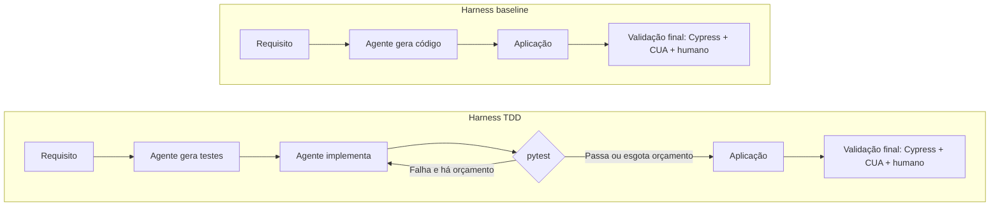
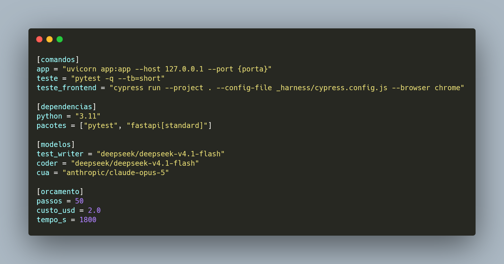
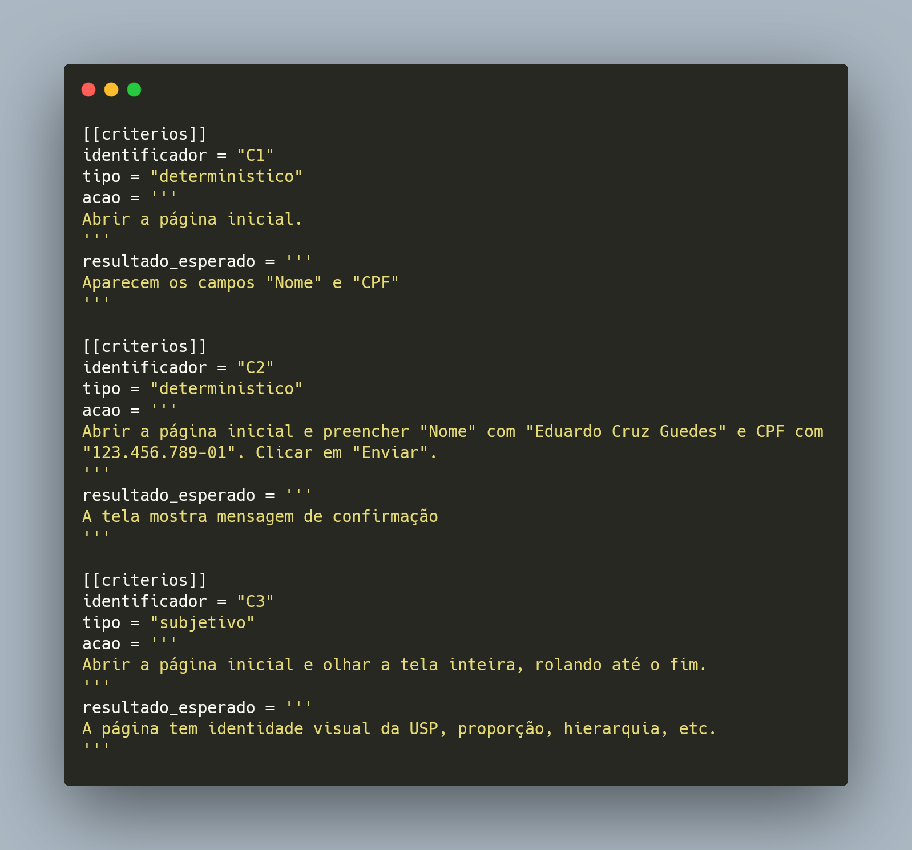

Hoje eu e os orientadores definimos o próximo passo: analisar as 200 runs do batch
com o Radon, selecionar as top 5 e fazer a validação final com Cypress, CUA e comigo
usando a página. Depois, escolher as top 2 para apresentar aos orientadores.

Talvez seja necessário rerodar algumas execuções que ficaram com problemas. Ainda
preciso conferir quais foram interrompidas e quais terminaram gerando uma aplicação
ruim, preservando as tentativas anteriores.

<!-- truncate -->

## Baseline X TDD

No baseline, o agente gera o código diretamente. No TDD, gera os testes primeiro e
usa o pytest como feedback da implementação. A validação final continua fora desse
loop. Agora, vamos aplicá-la às cinco selecionadas.

## Seleção com análise estática

O [Radon](https://pypi.org/project/radon/) calcula métricas do código Python, como
complexidade ciclomática, índice de manutenibilidade, métricas de Halstead e
contagens de linhas. Vamos rodá-lo sobre todas as runs e definir os critérios do
ranking a partir dessas medidas determinísticas.

Serão **cinco entre as 200 runs no total**, sem separar a seleção por modelo ou
grupo. Os critérios e pesos ainda precisam ser definidos. Essa análise cobre o
Python, não a interface; uma boa posição no ranking não garante que a página funcione.

## Validação e usabilidade

Nas top 5, o Cypress verifica comportamentos objetivos, o CUA interage com a página
e eu faço a avaliação humana. Junto disso, vamos usar uma escala de cinco categorias,
no estilo Likert:

**Péssimo · Ruim · Regular · Bom · Excelente**

A ideia é dar notas para facilidade de uso, facilidade de entendimento, identidade
visual da USP e outros aspectos da interface, com justificativas minhas e do CUA.

Quero incluir as [dez heurísticas de usabilidade de Jakob Nielsen](https://www.nngroup.com/articles/ten-usability-heuristics/)
como base dos critérios:

1. Visibilidade do estado do sistema.
2. Correspondência entre o sistema e o mundo real.
3. Controle e liberdade do usuário.
4. Consistência e padrões.
5. Prevenção de erros.
6. Reconhecimento em vez de memorização.
7. Flexibilidade e eficiência de uso.
8. Estética e design minimalista.
9. Ajuda para reconhecer, diagnosticar e corrigir erros.
10. Ajuda e documentação.

Precisamos traduzir essas heurísticas em verificações para a página. Por exemplo:
o Cypress verifica se aparece uma mensagem de erro; eu e o CUA avaliamos se ela
explica o problema e ajuda a resolvê-lo.

Com esses resultados, escolhemos as **top 2 para apresentar aos orientadores**.
É uma seleção dos destaques do lote; a avaliação das cinco não representa, sozinha,
o desempenho comportamental das 200 runs.

## Configuração

Os prints mostram o alvo usado pelo harness e exemplos dos critérios que vamos
ampliar para essa avaliação.

### Alvo

### Critérios

