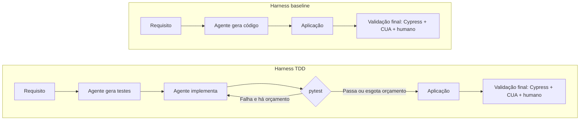

Hoje eu e os orientadores definimos o próximo passo: analisar as 200 runs do batch
com o Radon, selecionar as top 5 e fazer a validação final com Cypress, CUA e comigo
usando a página. Depois, escolher as top 2 para apresentar aos orientadores.

O plano não sobreviveu ao contato com os dados, e é disso que este post trata: o Radon
não serve para escolher as cinco melhores, e descobrir isso saiu mais barato do que
parecia — a régua que o desmente é a mesma que a validação final já usaria.

Talvez seja necessário rerodar algumas execuções que ficaram com problemas. Ainda
preciso conferir quais foram interrompidas e quais terminaram gerando uma aplicação
ruim, preservando as tentativas anteriores.

<!-- truncate -->

## Baseline X TDD

No baseline, o agente gera o código diretamente. No TDD, gera os testes primeiro e
usa o pytest como feedback da implementação. A validação final continua fora desse
loop. Agora, vamos aplicá-la às cinco selecionadas.



## Seleção com análise estática

O [Radon](https://pypi.org/project/radon/) calcula métricas do código Python, como
complexidade ciclomática, índice de manutenibilidade, métricas de Halstead e
contagens de linhas. Rodei o `analisar_batch.py` sobre as 200 runs. O lote atual
contém DeepSeek V4.1 Flash e GLM-5.3, com 50 runs por modelo e grupo. Os resultados
ficaram em `demos/runs/batch/radon.json` e `radon.csv`, com Python 3.11.14 e Radon
6.0.1. O script coleta métricas; ele não produz um ranking automaticamente.

Para uma primeira seleção exploratória, adotei o seguinte critério após a coleta:

1. Considerar apenas runs com implementação Python de sintaxe válida e todas as
   etapas marcadas como concluídas com sucesso no `RUN.log`.
2. Ordenar pelo **maior MI mínimo** entre os arquivos de implementação: priorizar
   o índice de manutenibilidade do arquivo com menor pontuação de cada run.
3. Desempatar pela **menor complexidade ciclomática máxima** (CC máxima). Quando
   não há funções ou métodos, a CC é ausente e fica depois dos valores medidos,
   sem ser convertida em zero.
4. Persistindo o empate, ordenar pelo caminho da run em ordem lexicográfica,
   apenas para tornar o recorte reproduzível, sem atribuir mérito a essa ordem.

Não há soma ponderada, quotas por modelo ou grupo, nem métricas dos testes no
ranking. Das 200 runs, **166 são elegíveis**: 94 baseline e 72 TDD. As outras 34
incluem nove sem Python de implementação, três com erro de sintaxe e 22 com
sintaxe válida, mas etapas sem sucesso. Essa triagem ainda não decide quais
precisam ser reexecutadas.

### Top 5 pelo critério adotado

Todas as cinco posições são do **GLM-5.3, grupo baseline**:

| Posição | Run | MI mínimo | CC máxima | Linhas de código Python (SLOC) | Por que aparece aqui |
|---|---|---:|---:|---:|---|
| 1 | `glm/run44/baseline` | 100 | 1 | 65 | MI máximo e CC medida igual a 1; precede as runs sem CC. |
| 2 | `glm/run12/baseline` | 100 | — | 1 | Empate em MI e CC ausente; posição definida pelo caminho. |
| 3 | `glm/run18/baseline` | 100 | — | 1 | Mesmo empate; posição definida pelo caminho. |
| 4 | `glm/run30/baseline` | 100 | — | 1 | Mesmo empate; posição definida pelo caminho. |
| 5 | `glm/run33/baseline` | 100 | — | 1 | Mesmo empate; posição definida pelo caminho. |

As runs `glm/run35/baseline`, `glm/run36/baseline` e `glm/run38/baseline` também
têm MI 100 e CC ausente. Portanto, as posições 2 a 5 não são melhores pelas
métricas do que essas três que ficaram fora do corte.

### O ranking premiou implementações incompletas

Ao conferir os arquivos, encontrei um problema concreto: nas runs 12, 18, 30 e
33, o `app.py` contém **somente `...`**. Isso é Python sintaticamente válido,
mas não implementa a aplicação. As runs 35 e 38 têm o mesmo conteúdo; a 36
contém imports e uma montagem de arquivos estáticos, seguida de um comentário
indicando que falta o restante do backend.

Na run 44, há modelos de dados e uma rota para servir o HTML, mas os endpoints
de geração do ofício ficaram como comentário. A CC máxima 1 corresponde à única
função, que retorna o arquivo da página. Os hashes dos arquivos conferem com
os registrados na análise.

No Radon instalado, o cálculo retorna MI 100 quando o volume de Halstead ou o
número de linhas considerado no cálculo é zero. Assim, esse valor pode aparecer
em código sem lógica implementada. O campo de sucesso das etapas também não
barrou esses casos, e o `pytest_final` das cinco registra zero testes.

Este é o **top 5 literal do critério exploratório**, não uma seleção validada das
melhores aplicações.

### O problema não era a elegibilidade, era o critério

A primeira reação foi excluir os esqueletos e ranquear de novo. Fiz isso, e a nova
primeira colocada foi a `glm/run10/baseline`: um `app.py` com `/api/ping`,
`/api/echo`, `/api/palindrome` e `/api/date` — nenhum deles no requisito — servindo
arquivos de um diretório `frontend/` que não existe na run.

O padrão não é coincidência, está na fórmula. O `mi_compute` do Radon calcula

```
MI = 171 − 5,2·ln(volume de Halstead) − 0,23·CC − 16,2·ln(SLOC)
```

que é estritamente decrescente nos três termos. **Ordenar por maior MI é ordenar por
menor quantidade de código, por construção.** Entre as runs elegíveis, a correlação
medida entre MI e SLOC é −0,50. Excluir um esqueleto não corrige isso: apenas promove
a próxima implementação menor. Índice de manutenibilidade e complexidade ciclomática
são indicadores de risco, não notas de qualidade — baixa complexidade só significa
alguma coisa em relação ao trabalho que o código realiza.

### Elegibilidade por estrutura, não por limiar

Em vez de calibrar um mínimo de linhas ou tratar MI 100 como sinônimo de vazio — os
dois seriam números escolhidos para dar o resultado que eu já queria —, a exclusão
passou a olhar a estrutura do código e registra o motivo de cada run no `radon.json`:

| Motivo | O que significa | Runs |
|---|---|---:|
| `ausente` | nenhum Python de implementação | 9 |
| `erro_sintaxe` | não compila | 3 |
| `etapas_sem_sucesso` | `RUN.log` com etapa sem sucesso | 22 |
| `sem_funcao` | não define nenhuma função ou método | 7 |
| `sem_decisao` | nenhuma função tem um único ponto de decisão | 1 |
| `sem_pagina` | nenhum `index.html` servido | 5 |

`sem_funcao` e `sem_decisao` são o piso das métricas, não limiares ajustados: um
backend que valida CPF, datas e campos obrigatórios sem nenhum desvio condicional em
nenhuma função não implementou nada. As duas regras capturam exatamente as oito runs
que a inspeção manual tinha encontrado, e nenhuma outra. `sem_pagina` é a única
condição fora do Radon, e existe porque o requisito é um formulário web: sem página,
não há aplicação a avaliar. Restam **153 elegíveis**, 81 baseline e 72 TDD.

### O que o Radon escolheu, e o que aconteceu quando testamos

O critério, aplicado às 153 elegíveis, escolhe estas cinco. Antes de mandá-las para a
avaliação final, passei as cinco pela suíte de comportamento descrita mais abaixo:

| Posição | Run | MI mínimo | CC máxima | SLOC | Critérios que passam |
|---|---|---:|---:|---:|---:|
| 1 | `glm/run4/baseline` | 53,00 | 8 | 67 | **0 / 12** |
| 2 | `deepseek/run40/tdd` | 43,64 | 24 | 179 | 12 / 12 |
| 3 | `glm/run28/baseline` | 43,42 | 20 | 115 | **1 / 12** |
| 4 | `glm/run21/baseline` | 40,21 | 7 | 61 | **0 / 12** |
| 5 | `glm/run24/baseline` | 39,65 | 22 | 164 | 8 / 12 |

Quatro das cinco não funcionam. Conferi a causa de cada uma no código:

- **`glm/run4`**, a primeira colocada, monta `public/` na raiz com `html=True`, mas
  `public/` contém apenas `app.js` — o `index.html` e o `style.css` ficaram na raiz do
  projeto. A aplicação põe os arquivos num lugar e serve outro; `GET /` devolve 404.
- **`glm/run21`** tem os três arquivos do frontend em disco e nenhuma rota que sirva
  qualquer um deles: o `app.py` declara só `POST /api/solicitacao`.
- **`glm/run28`** serve a raiz e a página renderiza — passa o C2, que confere abas,
  seções e botão. Falha em todo o resto: troca de aba, máscaras, validação e ofício.
- **`glm/run24`** falha de C10 a C13, os quatro critérios que dependem de gerar o ofício.

Isso encerra a discussão sobre o Radon como seletor, e não por má calibração: análise
estática de texto-fonte não tem como saber se a aplicação sobe, se a rota existe, se o
arquivo servido é o que está em disco. O Radon continua útil para **desqualificar** — a
elegibilidade estrutural acima é barata e correta — e é só isso que ele faz aqui.

## A régua: uma suíte para todas as runs

A suíte de Cypress que o harness gera é escrita por run, com seletor tirado do código
daquela implementação: `.aba-btn`, `#form-alunos`, `[data-campo="…"]`. Serve para avaliar
uma aplicação e não serve para comparar 153 — seriam 153 réguas diferentes.

A suíte canônica localiza os elementos só pelo que o requisito fixa: o texto visível.
`requisito.md` e `criterios.toml` são byte-idênticos entre os dois casos de uso — mudam
apenas o modelo e o teto de custo —, então a mesma suíte vale para as 200 runs, com custo
marginal zero e nenhuma chamada a modelo.

Validei contra resposta conhecida antes de confiar nela: na run `172316`, cuja avaliação
sob medida está registrada desde 11/09, a suíte canônica devolve **9 de 12, falhando C7,
C8 e C9** — exatamente os mesmos três. Repetida, mesmo veredito.

### Dois erros meus, achados por execução

Instrumento determinístico não nasce correto; ele só torna o erro reproduzível.

1. **`cy.contains(":visible", texto)` casa com o `<body>`.** O `body` é visível e seu
   `textContent` inclui os filhos escondidos, então a asserção "não está na tela" nunca
   falhava e o formulário da aba inativa contaminava todo veredito de troca de aba.
2. **Valor de preenchimento derivado de `name` e `id`.** Há run cujos inputs não têm nem
   um nem outro; os campos recebiam lixo, um obrigatório ficava vazio, e a validação
   nativa do browser barrava o envio. C10 a C13 reprovavam por falha do avaliador.

Antes das correções a run conhecida marcava 4 de 12; depois, os 9 corretos. Se eu tivesse
rodado as 153 antes de validar contra resposta conhecida, teria publicado um ranking com
cinco falsos negativos embutidos.

### Os 12 critérios são um portão, não uma ordenação

Com a régua funcionando apareceu o problema seguinte: **94 das 153 passam nos doze**.
Escrevi dez critérios adicionais tirados do `requisito.md` e não do `criterios.toml` —
máscaras de CEP e de data, mensagem de agência não numérica, mensagem de e-mail inválido,
a regra de mostrar todas as mensagens aplicáveis e não só a primeira, erro preservando a
aba e o preenchimento, placeholder em todo campo diferente do rótulo, os 26 rótulos
comuns nas duas abas, o ofício completo com as dezessete linhas do modelo, e a regra de
que link e complemento vazios somem do ofício. Rodei em cinco runs que já passavam nos
doze: **todas deram 10 de 10**.

Isso não é limitação do instrumento, é resultado. Quem implementa o requisito implementa
ele inteiro, e critério novo derivado do mesmo requisito não separa runs que já o
satisfazem. O que resta para distinguir aplicações equivalentes é justamente o que o
requisito deixa a julgamento — identidade visual e caber em uma tela —, e isso não é
determinístico. O desempate entre elas passou a ser o **custo de gerar**, que o `RUN.log`
mede e que dá ordem total: 28 valores distintos em 28 runs, amplitude de 8,9 vezes. Não é
nota de qualidade, e enviesa para o baseline, que gera menos.

## O resultado das 200 runs

Rodar a régua nas 153 elegíveis custou zero e cerca de 68 segundos por run. Só que
comparar elegíveis é comparar errado, porque **os dois grupos falham de formas
diferentes** e a triagem só enxerga uma delas:

| | inelegíveis | por quê |
|---|---:|---|
| GLM baseline | 19 / 50 | conteúdo: sem Python, sem página, sem função |
| GLM TDD | 27 / 50 | 21 delas `etapas_sem_sucesso`: o pipeline não terminou |

O baseline falha entregando uma aplicação completa e quebrada, que sobrevive à
elegibilidade e tira 0 de 12. O TDD falha não entregando, e sai antes de ser medido.
Contar só as elegíveis esconde a falha do TDD e mostra a do baseline. O denominador
honesto é 50 runs por célula, com run inelegível valendo zero — ela também não produziu
aplicação que suba.

| | runs | média / 12 | aplicações corretas |
|---|---:|---:|---:|
| DeepSeek baseline | 50 | 11,10 | **41 (82%)** |
| DeepSeek TDD | 50 | 11,06 | 38 (76%) |
| GLM baseline | 50 | 2,28 | 3 (6%) |
| GLM TDD | 50 | 4,38 | **12 (24%)** |
| **Baseline** | 100 | 6,69 | 44 (44%) |
| **TDD** | 100 | 7,72 | 50 (50%) |

O efeito não está no agregado, está na interação com o modelo. **No modelo forte o TDD
não ajuda** — 82% contra 76%, com o baseline à frente. **No modelo fraco o TDD
quadruplica o aproveitamento**, de 6% para 24%. A vantagem geral de 50% contra 44% vem
inteira do GLM.

Um número separa os grupos de forma limpa: **nenhuma run TDD tirou 0 de 12; doze runs
baseline tiraram** — sete não servem nenhuma página, duas nem sobem (a
`glm/run15/baseline` declara `dict[str, Campo]` com `Campo` sendo classe comum, e o
pydantic não gera o schema), três rodam e falham tudo. O portão do pytest não garante
aplicação correta, mas parece garantir aplicação que existe.

Os limites continuam de pé. É um requisito só, dois modelos, uma execução por célula, e
os doze critérios cobrem o que se verifica sem julgamento — não medem identidade visual
nem uso. A diferença entre 82% e 76% no DeepSeek está dentro do que 50 runs não
distinguem; a diferença entre 6% e 24% no GLM, não.

## Validação e usabilidade

O Cypress já respondeu o que respondia, e nas 153 elegíveis em vez de em cinco. O que
sobra para as finalistas é exatamente o que ele não alcança: o CUA interage com a página
e eu faço a avaliação humana. Nenhuma sessão de CUA rodou ainda — até aqui é tudo
determinístico. Para essa parte, uma escala de cinco categorias, no estilo Likert:

**Péssimo · Ruim · Regular · Bom · Excelente**

A ideia é dar notas para facilidade de uso, facilidade de entendimento, identidade
visual da USP e outros aspectos da interface, com justificativas minhas e do CUA.

Quero incluir as [dez heurísticas de usabilidade de Jakob Nielsen](https://www.nngroup.com/articles/ten-usability-heuristics/)
como base dos critérios:

1. Visibilidade do estado do sistema.
2. Correspondência entre o sistema e o mundo real.
3. Controle e liberdade do usuário.
4. Consistência e padrões.
5. Prevenção de erros.
6. Reconhecimento em vez de memorização.
7. Flexibilidade e eficiência de uso.
8. Estética e design minimalista.
9. Ajuda para reconhecer, diagnosticar e corrigir erros.
10. Ajuda e documentação.

Precisamos traduzir essas heurísticas em verificações para a página. A divisão ficou
clara depois desta rodada: o Cypress verifica se a mensagem de erro aparece com o texto
exato; eu e o CUA avaliamos se ela explica o problema e ajuda a resolvê-lo.

Com esses resultados, escolhemos as **top 2 para apresentar aos orientadores**. A
diferença em relação ao plano da manhã é de onde saem as cinco finalistas: não de um
ranking do Radon, que erraria quatro em cinco, mas das 94 runs que passam nos doze
critérios, desempatadas pelo custo de gerar.

## Configuração

Os prints mostram o alvo usado pelo harness e exemplos dos critérios que vamos
ampliar para essa avaliação.

### Alvo


### Critérios


