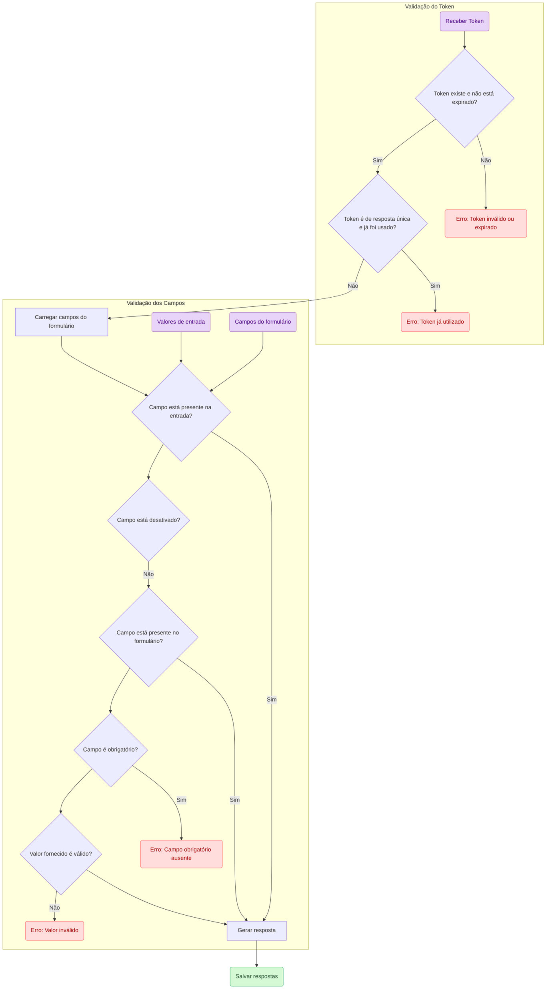

```mermaid
flowchart TD
    %% Bloco: Validação do Token
    subgraph Bloco1[Validação do Token]
        A(Receber Token) --> B{Token existe e não está expirado?}
        B -->|Não| R1(Erro: Token inválido ou expirado)
        B -->|Sim| C{Token é de resposta única e já foi usado?}
        C -->|Sim| R2(Erro: Token já utilizado)
    end
    C -->|Não| D[Carregar campos do formulário]

    %% Bloco: Validação dos Campos
    subgraph Bloco2[Validação dos Campos]
        E(Valores de entrada) --> G{Campo está presente na entrada?}
        F(Campos do formulário) --> G
        D --> G

        G -->|Sim| L[Gerar resposta]

        G --> H{Campo está desativado?}
        H -->|Não| I{Campo está presente no formulário?}
        I -->|Sim| L
        I --> J{Campo é obrigatório?}
        J -->|Sim| R4(Erro: Campo obrigatório ausente)
        J --> K{Valor fornecido é válido?}
        K --> L
        K -->|Não| R5(Erro: Valor inválido)
    end

    %% Bloco: Resultado Final
    L --> Z(Salvar respostas)

    classDef erro fill:#ffdddd,stroke:#ff5c5c,color:#a00000
    classDef saida fill:#d4f9d4,stroke:#3cb371,color:#1e4d2b
    classDef entrada fill:#e8d4f8,stroke:#9b59b6,color:#4b0082

    class A,E,F entrada
    class R1,R2,R4,R5 erro
    class Z saida
```